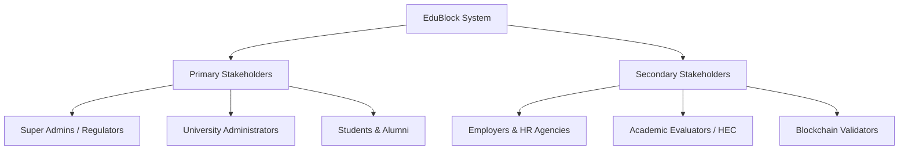
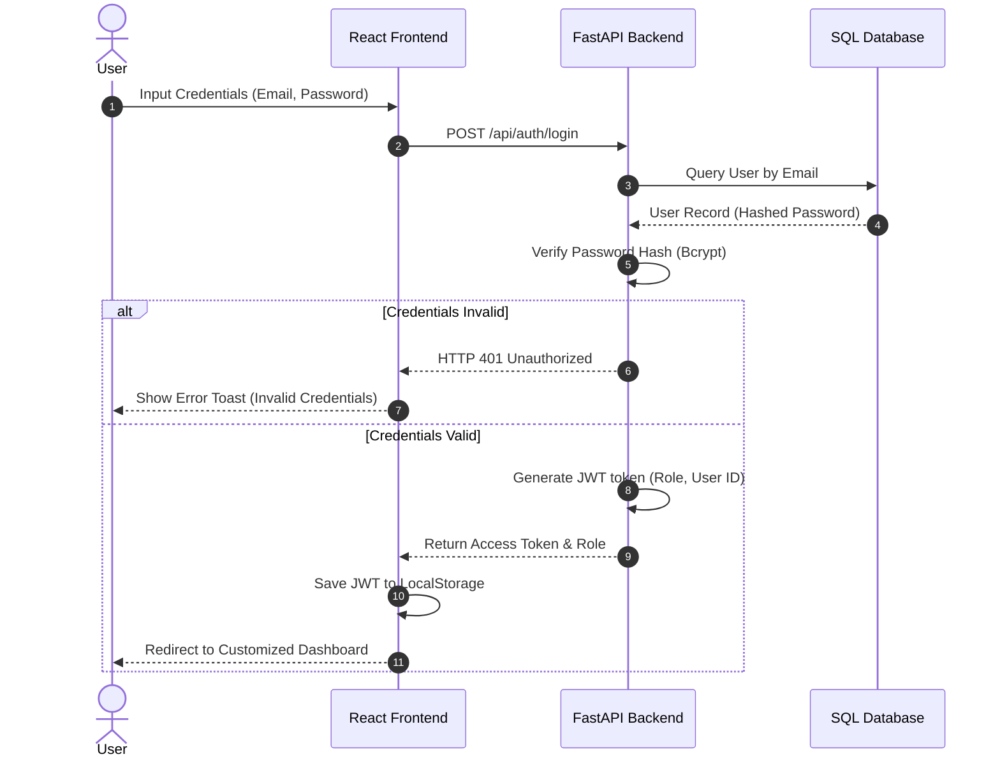
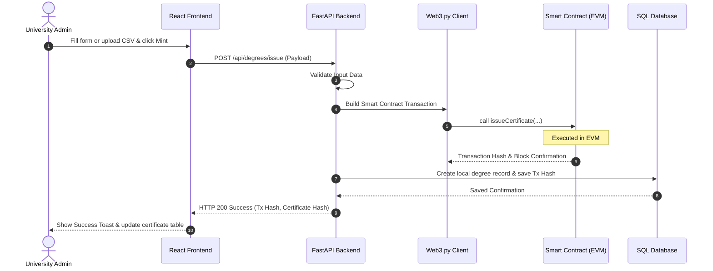
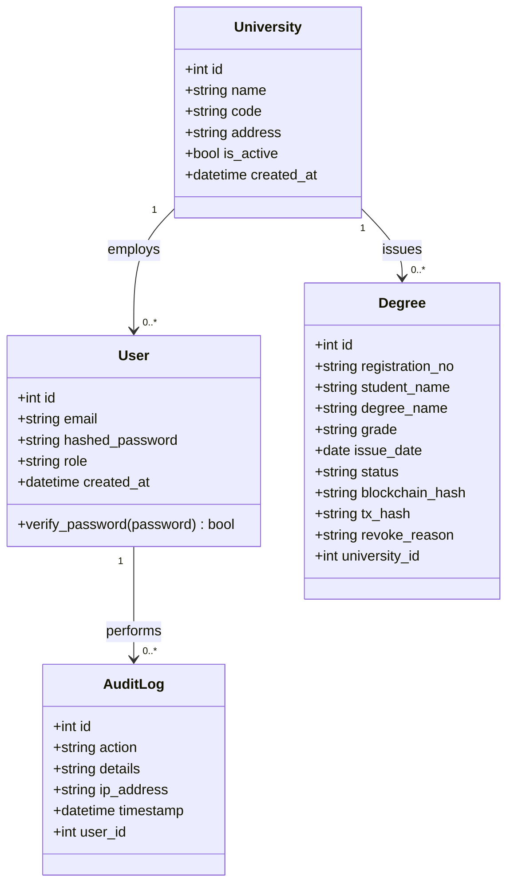
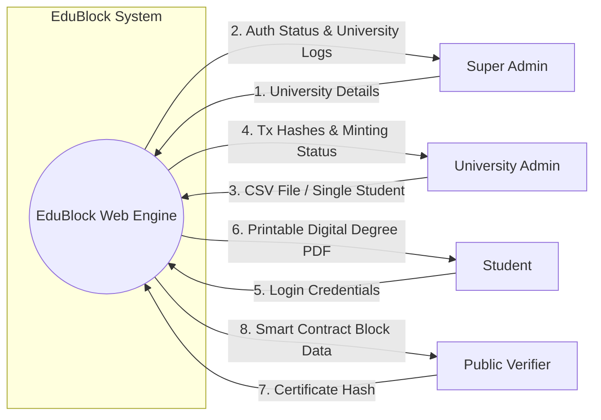
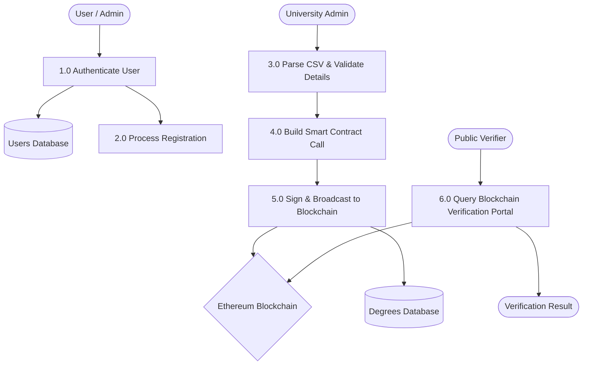
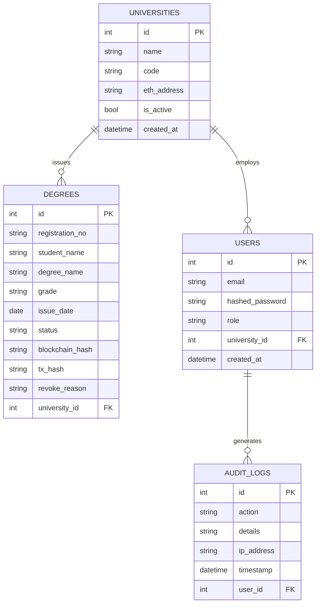

# EduBlock: A Blockchain-Based Academic Certificate Issuance and Verification System

## TECHNICAL REPORT

**SUBMITTED BY:**
[Your Name]
[Your AG # / Registration Number]

**ADVISED BY:**
[Supervisor Name]

**A TECHNICAL REPORT SUBMITTED IN PARTIAL FULFILLMENT OF REQUIREMENT FOR THE DEGREE OF**
**MASTER OF SCIENCE IN COMPUTER SCIENCE**

**DEPARTMENT OF COMPUTER SCIENCE**
**FACULTY OF SCIENCES**
**UNIVERSITY OF AGRICULTURE, FAISALABAD**

---

## DECLARATION

I hereby declare that the contents of the report [“EduBlock”] are project of my own research and no part has been copied from any published source (except the references). I further declare that this work has not been submitted for award of any other diploma/degree. The university may take action if the information provided is found false at any stage. In case of any default the scholar will be proceeded against as per UAF policy.

_________________
[Your Name]

---

## CERTIFICATE

To,
The Controller of Examinations,
University of Agriculture,
Faisalabad.

The supervisory committee certify that [Your Name] [Your AG #] has successfully completed his project in partial fulfillment of requirement for the degree of M.Sc. Computer Science under our guidance and supervision.

_____________________________________
[Supervisor Name]
Supervisor

_____________________________________
[Member Name]
Member

_______________________________________
Dr. Muhammad Ahsan Latif
Incharge,
Department of Computer Science

---

## ACKNOWLEDGEMENT

I thank all who in one way or another contributed in the completion of this report. First, I thank to ALLAH ALMIGHTY, most magnificent and most merciful, for all his blessings. Then I am so grateful to the Department of Computer Science for making it possible for me to study here. My special and heartily thanks to my supervisor who encouraged and directed me. His/her challenges brought this work towards a completion. It is with his/her supervision that this work came into existence. For any faults I take full responsibility. I am also deeply thankful to my informants. I want to acknowledge and appreciate their help and transparency during my research. I am also so thankful to my fellow students whose challenges and productive critics have provided new ideas to the work. Furthermore, I also thank my family who encouraged me and prayed for me throughout the time of my research. May the Almighty God richly bless all of you.

---

## ABSTRACT

In recent years, the proliferation of academic credential fraud has become a critical global concern, damaging the reputation of academic institutions and devaluing legitimate achievements. Traditional paper-based degree certificates are vulnerable to physical forgery, while conventional digital verification systems rely on centralized databases that are susceptible to single points of failure, unauthorized database manipulation, and cyberattacks. To resolve these security and trust challenges, **EduBlock**, a decentralized, blockchain-based academic certificate issuance and verification system, has been proposed and developed.

EduBlock is designed as a secure, decentralized web application that permits the cryptographic minting, storage, and instant public verification of academic certificates. The platform uses Ethereum-compatible smart contracts written in Solidity to record degree hashes immutably on the blockchain network, ensuring absolute tamper-proof security. The system architecture is built using a modern 3-tier model: a responsive React and Tailwind CSS frontend for presentation, an asynchronous FastAPI backend for business logic processing, and a hybrid storage layer consisting of a relational SQLite/PostgreSQL database for local application logs and the decentralized Ethereum blockchain (Simulated via Ganache or deployed on Sepolia Testnet) for immutable verification. 

The application implements granular role-based access control, offering customized dashboards for the **Super Admin** (to register and manage verified universities), the **University Admin** (to cryptographically issue certificates individually or in bulk via CSV files), and the **Student** (to view, download, and share their credentials). Additionally, a publicly accessible **Verification Portal** allows employers and third-party verifiers to validate any certificate hash directly against the blockchain in real-time, receiving instant, cryptographically secure validation without requiring login credentials. 

The development of EduBlock followed the Agile Software Development Model, allowing rapid iteration, extensive testing, and deployment. Results demonstrated that the application successfully eliminates the risk of credential tampering while reducing verification times from weeks to seconds. EduBlock provides a state-of-the-art solution that aligns academic credentialing with modern cryptographic security standards.

---

## Table of Contents
* **Chapter 1 - INTRODUCTION**
  * 1.1 Background
  * 1.2 Description
  * 1.3 Problem Statement
  * 1.4 Scope
  * 1.5 Objectives
  * 1.6 Feasibility Study
  * 1.7 Requirements Specification
  * 1.8 Stakeholders
* **Chapter 2 - METHODOLOGY**
  * 2.1 Process Model (Agile SDLC)
  * 2.2 Tools & Technologies
  * 2.3 System Design & Diagrams
    * 2.3.1 Use Case Diagram & Scenarios
    * 2.3.2 Sequence Diagrams
    * 2.3.3 Class Diagram
    * 2.3.4 Data Flow Diagrams (DFD)
    * 2.3.5 Entity Relationship Diagram (ERD)
    * 2.3.6 Database Relational Model
    * 2.3.7 3-Tier System Architecture
* **Chapter 3 - RESULTS & DISCUSSION**
  * 3.1 System Testing Methodology
  * 3.2 Key Test Cases
  * 3.3 Limitations & Future Work
  * 3.4 Conclusion
* **Chapter 4 - USER MANUAL**
  * 4.1 Home Screen & Public Verification
  * 4.2 Super Admin Portal
  * 4.3 University Admin Portal
  * 4.4 Student Portal
  * 4.5 References

---

# Chapter 1 - INTRODUCTION

### 1.1 Background
Academic certificates are the primary proof of an individual’s education, skills, and qualifications. They represent years of hard work and serve as the ticket for career advancement, higher education, and employment opportunities. However, the integrity of academic credentialing is under severe threat. The global trade in counterfeit degrees—facilitated by sophisticated digital printing tools, online diploma mills, and deep web services—has grown into a multi-billion dollar illicit market. 

Traditional paper-based academic certificates lack native security mechanisms. They are vulnerable to water damage, physical theft, and easily forgeable using high-quality replica paper, embossed stamps, and signature replication. When checking legitimacy, employers and government agencies rely on manual background verification processes. These processes typically involve mailing the academic registry, calling the university administration, or sending representatives in person. Consequently, a single certificate verification can take anywhere from weeks to months, causing administrative bottlenecks and hiring delays.

Digital alternative solutions have emerged, such as centralized web portals or digital PDF databases. However, these systems rely on centralized databases managed by individual universities. Centralized architectures possess structural security weaknesses:
1. **Single Point of Failure (SPOF):** If the centralized server goes down, the verification service is entirely interrupted.
2. **Insider Threats:** Unauthorized employees, databases admins, or hackers with compromised credentials can alter, insert, or delete records in a SQL database, creating "authentic-looking" fake degrees.
3. **Data Loss:** Centralized storage is highly vulnerable to ransomware, server physical damage, or database corruption.

Blockchain technology offers a groundbreaking solution to these vulnerabilities. Built as a decentralized, distributed, and append-only ledger, blockchain uses cryptographic hashing and consensus mechanisms to make data immutable. Once a record is written on a block and distributed across the peer-to-peer network, it cannot be altered, deleted, or backdated. By utilizing Solidity smart contracts, universities can record a unique cryptographic signature (hash) of each academic certificate on the blockchain ledger. This turns academic certificates into permanent, tamper-proof, and instantly verifiable records.

---

### 1.2 Description
**EduBlock** is a decentralized, blockchain-based academic certificate issuance and verification application. It provides a secure, streamlined platform where academic institutions can cryptographically mint digital degrees, students can store and access them, and third-party verifiers (e.g., employers) can validate their authenticity in real-time. 

```
+-----------------------------------------------------------------------------------+
|                                     EDUBLOCK                                      |
+--------------------------+----------------------------+---------------------------+
|      SUPER ADMIN         |     UNIVERSITY ADMIN       |          STUDENT          |
|  - Register Universities |  - Issue Degrees (Single)  |  - View Digital Degrees   |
|  - Manage Admins         |  - Bulk Upload (CSV)       |  - Download / Print       |
|  - Audit Log Tracking    |  - Track Tx on Blockchain  |  - Copy Verification Hash |
+--------------------------+----------------------------+---------------------------+
```

EduBlock replaces the outdated manual certificate distribution workflow with a modern, high-speed digital pipeline:
* **Decentralized Verification:** Academic degrees are registered on the Ethereum Blockchain network via Web3.py. The public can input the unique transaction/degree hash on the platform's verification portal to compare it instantly against the blockchain state, eliminating the need for institutional intermediaries.
* **Granular Roles:** The system implements strict role-based dashboards:
  1. **Super Admin Dashboard:** Acts as the root authority to register, update, or suspend accredited universities and issue university admin credentials.
  2. **University Admin Dashboard:** Empowered to mint certificates one by one or in bulk by uploading a standard CSV file. The system processes the data, signs transactions via smart contracts, and saves corresponding logs locally.
  3. **Student Dashboard:** Enables students to view their verified credentials, download printable versions, and access their blockchain hashes for job applications.
* **Public Verification Portal:** A lightweight, non-authenticated search bar on the landing page where anyone can paste a certificate hash and receive a comprehensive validation status containing the student's name, degree title, issue date, university, and the matching block number on the blockchain.

---

### 1.3 Problem Statement
The current academic credentialing and verification ecosystem is plagued by security vulnerabilities, administrative inefficiency, and lack of transparency. The primary pain points are categorized as follows:

```
                  +----------------------------------------------+
                  |         The Credentialing Problem            |
                  +----------------------+-----------------------+
                                         |
         +-------------------------------+-------------------------------+
         |                               |                               |
+--------v--------+             +--------v--------+             +--------v--------+
|  Vulnerability  |             | Administrative  |             | Centralization  |
|   to Forgery    |             |   Inefficiency  |             |  Vulnerabilities|
|                 |             |                 |             |                 |
| Paper degrees   |             | Manual checks   |             | Single database |
| are easily      |             | take weeks;     |             | can be hacked   |
| replicated.     |             | delays hiring   |             | or manipulated. |
+-----------------+             +-----------------+             +-----------------+
```

1. **High Susceptibility to Forgery:** High-resolution scanners and professional image editing software allow unauthorized parties to counterfeit diplomas, official transcripts, and signatures. 
2. **Administrative Inefficiency:** The verification of degrees is a manual, paper-heavy process. Employers must contact the registrar office of universities, fill out verification request forms, pay fees, and wait weeks for a response. This delays recruitment pipelines and consumes significant university administrative labor.
3. **Database Centralization and Tampering:** Existing electronic databases are centralized. A rogue database administrator, an internal employee accepting bribes, or an external hacker exploiting SQL injection vulnerabilities can inject fraudulent records or modify graduation statuses directly in the database.
4. **Lack of Student Control:** Students often lose physical certificates due to displacement, natural disasters, or wear-and-tear. Obtaining official duplicates from universities involves complex paperwork, high fees, and long processing queues.

EduBlock addresses this set of problems by removing the central database trust requirement and replacing manual validation with automatic, cryptographic on-chain verification.

---

### 1.4 Scope
The scope of EduBlock is to develop a gamified, cross-platform academic certificate issuance and verification application that combines lessons, quizzes, puzzles, and progress tracking in one unified platform. It targets students, programming beginners, and professionals seeking to build or refresh their Python skills.
* **Accreditation Management:** Super Admin tools to onboard legitimate higher education institutions and grant cryptographic issuing authorization.
* **Cryptographic Certificate Issuance:** University Admin tools to generate, sign, and broadcast certificates to the blockchain. This includes a single-entry UI form and an automated bulk CSV parsing engine to process hundreds of records simultaneously.
* **Smart Contract Integration:** Solidity smart contracts deployed on local networks (Ganache) or public testnets (Sepolia) to record `(Registration No, Student Name, Degree Name, Grade, Issue Date, Blockchain Hash)` immutably.
* **Public Cryptographic Validation:** A public verification engine that interfaces with the Web3 provider, calling the smart contract’s read methods to check if a specific hash exists in the contract storage.
* **Responsive UX/UI:** Sleek dark-mode dashboards with micro-animations, glassmorphism components, and live status bars for real-time tracking of blockchain minting transactions.

**Out of Scope:** The system simulates or works on blockchain testnets for credential registration; it does not mandate real Ethereum mainnet gas payments for academic evaluations. The conversion of physical degrees to PDFs is handled via high-fidelity CSS and `html2canvas` library generation within the browser rather than maintaining heavy binary files in server storage.

---

### 1.5 Objectives
The technical objectives of the EduBlock project are:
1. **Develop an Immutable Blockchain Ledger:** Write, test, and deploy Solidity smart contracts that store degree records securely on-chain.
2. **Provide Real-Time Verification:** Create a public-facing portal that performs instant cryptographic checks directly against the blockchain in less than 3 seconds.
3. **Implement Granular Multi-Tenant Access:** Set up secure JWT (JSON Web Token) authentication and role-based middleware for Super Admins, University Admins, and Students.
4. **Build a High-Speed Bulk Minting Pipeline:** Design a CSV parsing system on the React frontend and FastAPI backend capable of processing, validating, and minting dozens of student records in one click.
5. **Establish Fault-Tolerant Client Notifications:** Implement resilient error boundaries and persistent, copyable error notification panels to handle transaction timeouts, network delays, or duplicate record submissions without crashing.
6. **Deploy a Hybrid Storage Layer:** Combine the speed of local SQL databases (for user credentials and audit logs) with the absolute security of the decentralized Ethereum blockchain (for degree proof).

---

### 1.6 Feasibility Study
Before initiating development, a comprehensive feasibility study was conducted to ensure the project’s practicality, compliance, and viability.

#### 1.6.1 Technical Feasibility
The development stack is highly mature and technically feasible. Flutter, React, Vite, and Tailwind CSS provide stable web environments. FastAPI utilizes asynchronous Python `async/await` paradigms, enabling high-performance RESTful operations. Web3.py is the industry-standard library for interfacing Python backend code with the Ethereum virtual machine. MetaMask, Ganache, and Sepolia testnets provide highly documented sandbox environments for blockchain interaction. The development team possesses the necessary coding competencies in JavaScript, Python, and Solidity.

#### 1.6.2 Schedule Feasibility
Using the Agile Software Development Model, the project was divided into 4 main sprints over a 16-week academic timeline. The division of tasks (Backend development, Smart Contract authoring, Frontend integration, and System testing) ensured that the MVP (Minimum Viable Product) was fully functional within the scheduled deadline.

#### 1.6.3 Economic Feasibility
EduBlock is highly cost-effective. All core frameworks (FastAPI, React, SQLite) and development environments (VS Code, Git, Node.js) are free and open-source. For blockchain integration, local simulations (Ganache) are completely free, and testnets (Sepolia) provide mock ether for smart contract deployments via public faucets. No expensive enterprise database licenses or proprietary security hardware are required, making the system highly economical for educational institutions.

#### 1.6.4 Cultural & Environmental Feasibility
EduBlock introduces positive cultural changes by fostering academic honesty and digital modernization in universities. It eliminates the bureaucracy of paper degree issuance. Environmentally, the digital transition reduces paper consumption, printer ink usage, and transport costs associated with physical degree distribution.

#### 1.6.5 Legal & Ethical Feasibility
The platform respects user data privacy. Student names and degree titles are linked cryptographically. No private keys or password credentials are stored on the public blockchain ledger; only cryptographic hashes are stored on-chain. The system complies with general academic transparency laws and digital signature authentication policies.

#### 1.6.6 Resource Feasibility
All hardware resources (Intel Core i5/i7 development laptops, 8GB RAM, and standard testing browsers) and software tools (Git, NPM, Python environment) were readily available to the development team, posing no resource constraints.

#### 1.6.7 Operational Feasibility
Once deployed on cloud platforms (e.g., Render for backend, Vercel for frontend, and Sepolia for blockchain), the application is fully self-sustaining. The interface is designed to be highly intuitive; administrative users only require basic CSV file handling skills to operate the bulk issuing system, ensuring seamless operational adoption.

---

### 1.7 Requirements Specification

#### 1.7.1 Functional Requirements (FR)

| Req ID | Title | Description |
| :--- | :--- | :--- |
| **FR01** | **Multi-Role Authentication** | Secure login and JWT generation for Super Admin, University Admin, and Students. |
| **FR02** | **Accreditation Hub** | Super Admin must be able to add, read, update, and suspend universities. |
| **FR03** | **Single Degree Issuance** | University Admin can input a single student's details and mint the degree. |
| **FR04** | **Bulk CSV Processing** | University Admin can upload a CSV, validate student records, and mint all in bulk. |
| **FR05** | **Smart Contract Register** | The system must write the degree record to the blockchain via a Solidity smart contract. |
| **FR06** | **Student Dashboard** | Registered students can view, search, and download high-quality PDF certificates. |
| **FR07** | **Public Hash Verification** | Public users can input a certificate hash to instantly verify degree authenticity on-chain. |
| **FR08** | **System Audit Logs** | Comprehensive logs of all administrative actions, logins, and minting events. |

#### 1.7.2 Non-Functional Requirements (NFR)
* **NFR01: Security:** Passwords must be hashed using high-security algorithms (bcrypt) before database insertion. All API routes must be protected using JWT tokens.
* **NFR02: Responsiveness:** The UI must adapt fluidly across mobile screens, tablets, and desktop displays (Fully responsive layout).
* **NFR03: Performance:** The public verification page must fetch blockchain records in less than 3 seconds.
* **NFR04: Robustness:** The frontend must implement error boundaries and handle network delays or validation failures gracefully without crashing.
* **NFR05: Availability:** The application must maintain high availability, hosted on distributed server platforms.

#### 1.7.3 Hardware Requirements
* **Processor:** Minimum Intel Core i3 / Ryzen 3 or equivalent.
* **RAM:** Minimum 4 GB (8 GB recommended for running local blockchains).
* **Storage:** 150 MB of free hard disk space.
* **Network:** Stable internet connection for interacting with Ethereum testnets.

#### 1.7.4 Software Requirements
* **Operating System:** Windows 10/11, macOS, or Linux.
* **Development IDE:** Visual Studio Code.
* **Languages & Runtimes:** Node.js (v18+), Python (v3.9+).
* **Databases:** SQLite (local development), PostgreSQL (production).
* **Blockchain Tools:** Ganache (local EVM), MetaMask, Remix IDE.

---

### 1.8 Stakeholders



* **Super Admins:** Government regulators or supreme academic bodies (e.g., Higher Education Commission) who authenticate and authorize universities.
* **University Administrators:** Registrar offices, exam branch staff, and academic coordinators who upload CSV data and mint certificates.
* **Students & Alumni:** The beneficiaries who securely access, download, and share their cryptographically signed credentials.
* **Employers & HR Agencies:** Third-party recruiters who verify candidate credentials instantly without background check costs.
* **Blockchain Validators:** Nodes running on the Ethereum network that validate, sequence, and record EduBlock transactions.

---

# Chapter 2 - METHODOLOGY

### 2.1 Process Model (Agile SDLC)
The development of EduBlock followed the **Agile Software Development Model**. Due to the dynamic nature of blockchain smart contracts and frontend-backend APIs, Agile provided the necessary flexibility to refine requirements, perform continuous integration, and respond to testing feedback iteratively.

```
                      +-------------------+
                      |   Agile Sprint    |
                      +---------+---------+
                                |
        +----------+------------+------------+----------+
        |          |                         |          |
+-------v---+  +---v-------+             +---v-------+  +---v-------+
|  Sprint 1 |  |  Sprint 2 |             |  Sprint 3 |  |  Sprint 4 |
| Contract  |  |  Backend  |             |  Frontend |  | Integration|
|  & Database| |   APIs    |             |Dashboards |  |  & Testing|
+-----------+  +-----------+             +-----------+  +-----------+
```

Each sprint lasted approximately 3-4 weeks and delivered a concrete, testable increment of the system:
1. **Sprint 1: Smart Contract & Database Foundation (Weeks 1-4):** Wrote the `Certification.sol` smart contract, deployed it on Ganache, and configured the SQLite database models using SQLAlchemy.
2. **Sprint 2: Backend API Development (Weeks 5-8):** Created the FastAPI application, implemented secure authentication routes, and wrote Web3.py wrappers to sign and broadcast blockchain transactions.
3. **Sprint 3: Frontend Dashboards & CSV Parsing (Weeks 9-12):** Built the Super Admin, University Admin, and Student portals in React, and created the responsive public verification layout.
4. **Sprint 4: Integration, Testing, and Deployment (Weeks 13-16):** Connected frontend Axios calls to backend routes, conducted load testing, implemented robust error notifications, and deployed to Vercel/Render.

---

### 2.2 Tools & Technologies
The technical stack of EduBlock comprises modern, high-performance open-source tools:

* **Frontend:**
  * **React.js & Vite:** A fast, component-based frontend framework with optimized hot module reloading.
  * **Tailwind CSS:** Utility-first CSS framework used to build beautiful glassmorphism dark-mode UI.
  * **Axios:** Asynchronous HTTP client for connecting frontend hooks to FastAPI endpoints.
* **Backend:**
  * **FastAPI:** High-performance, asynchronous Python web framework built on ASGI standards.
  * **SQLAlchemy:** Powerful ORM (Object Relational Mapper) to interact securely with SQL databases.
  * **Pydantic:** Strictly validates incoming requests and outgoing response schemas.
* **Blockchain:**
  * **Solidity:** Smart contract programming language for defining degree schemas on-chain.
  * **Web3.py:** Python library for signing and sending transaction payloads to the Ethereum blockchain.
  * **Ganache:** Local virtual Ethereum blockchain used for high-speed simulation and testing.
  * **Sepolia Testnet:** Deployed network to test real-world smart contract execution.

---

### 2.3 System Design & Diagrams

#### 2.3.1 Use Case Diagram & Scenarios

```mermaid
usecaseDiagram
    actor "Super Admin" as SA
    actor "University Admin" as UA
    actor "Student" as ST
    actor "Public Verifier" as PV

    SA --> (Login / Logout)
    SA --> (Register Universities)
    SA --> (View Audit Logs)

    UA --> (Login / Logout)
    UA --> (Mint Single Certificate)
    UA --> (Bulk Issue via CSV)
    UA --> (View Issuance History)

    ST --> (Login / Logout)
    ST --> (View Digital Certificates)
    ST --> (Download PDF Degree)

    PV --> (Search & Verify Certificate Hash)
```

##### Table 2.1: Use Case Scenario - User Login (UC01)
* **Use Case ID:** UC01
* **Actor:** All registered users (Super Admin, University Admin, Student)
* **Pre-conditions:** User account exists in database. Internet and local databases are operational.
* **Description:** Describes how a user securely authenticates and accesses their customized role dashboard.
* **Flow of Events:**
  1. User opens the EduBlock web application.
  2. User inputs their registered email and password on the login screen.
  3. System validates input formats and triggers the login API endpoint.
  4. Backend verifies credentials against database hashes using bcrypt.
  5. If valid, backend generates a JWT token and redirects user to their respective dashboard.
* **Post-conditions:** User is authenticated and granted role-based access.

##### Table 2.2: Use Case Scenario - Bulk Certificate Minting (UC02)
* **Use Case ID:** UC02
* **Actor:** University Admin
* **Pre-conditions:** Admin is logged in. Valid CSV file containing student records exists. Smart contract is active.
* **Description:** Describes the automated processing, signing, and on-chain minting of multiple degrees.
* **Flow of Events:**
  1. Admin navigates to the "Bulk Issue" tab.
  2. Admin uploads a CSV file containing columns: `Registration No`, `Student Name`, `Degree Name`, `Grade`, `Issue Date`.
  3. Frontend parses the CSV, validates datatypes, and checks for missing columns.
  4. Admin clicks "Mint All".
  5. Backend signs a batch transaction payload, broadcasts it to the blockchain via Web3.py, and waits for block confirmation.
  6. On success, degree records are created in local database and success toast is displayed.
* **Post-conditions:** Degree records are permanently stored on-chain and registered locally.

---

#### 2.3.2 Sequence Diagrams

##### Sequence Diagram: User Authentication & Login



##### Sequence Diagram: Certificate Minting (On-Chain)



---

#### 2.3.3 Class Diagram



---

#### 2.3.4 Data Flow Diagrams (DFD)

##### Context Level DFD (Level 0)



##### Level 1 DFD: Detailed Process Flow



---

#### 2.3.5 Entity Relationship Diagram (ERD)



---

#### 2.3.6 Database Relational Model (SQL Schemas)
The local database model utilizes a clean relational SQL structure to manage metadata, authentication, and audits.

* **Universities Table:** Stores official registered institutes.
  * `id` (INTEGER, Primary Key, Auto-increment)
  * `name` (VARCHAR(150), Not Null)
  * `code` (VARCHAR(20), Unique, Not Null)
  * `eth_address` (VARCHAR(42), Unique)
  * `is_active` (BOOLEAN, Default True)
  * `created_at` (DATETIME, Default UTC_NOW)
* **Users Table:** Manages access control and authentication.
  * `id` (INTEGER, Primary Key, Auto-increment)
  * `email` (VARCHAR(100), Unique, Not Null)
  * `hashed_password` (VARCHAR(128), Not Null)
  * `role` (VARCHAR(20), e.g., 'superadmin', 'admin', 'student')
  * `university_id` (INTEGER, Foreign Key referencing `universities.id`, Nullable)
* **Degrees Table:** Logs certificates issued by universities.
  * `id` (INTEGER, Primary Key, Auto-increment)
  * `registration_no` (VARCHAR(50), Unique, Not Null)
  * `student_name` (VARCHAR(100), Not Null)
  * `degree_name` (VARCHAR(150), Not Null)
  * `grade` (VARCHAR(10))
  * `issue_date` (DATE)
  * `status` (VARCHAR(20), Default 'Pending')
  * `blockchain_hash` (VARCHAR(66), Unique, Not Null)
  * `tx_hash` (VARCHAR(66), Unique)
  * `revoke_reason` (VARCHAR(250), Nullable)
  * `university_id` (INTEGER, Foreign Key referencing `universities.id`)
* **AuditLogs Table:** Tracks security sensitive operations.
  * `id` (INTEGER, Primary Key, Auto-increment)
  * `action` (VARCHAR(100), Not Null)
  * `details` (VARCHAR(500))
  * `ip_address` (VARCHAR(45))
  * `timestamp` (DATETIME, Default UTC_NOW)
  * `user_id` (INTEGER, Foreign Key referencing `users.id`)

---

#### 2.3.7 3-Tier System Architecture
EduBlock adopts a strictly decoupled **3-Tier System Architecture** to maximize modularity, performance, and security.

```
+-------------------------------------------------------------------------+
|                       PRESENTATION TIER (Frontend)                       |
|   - React.js Web Client                                                 |
|   - Tailwind CSS Styles (Dark Glassmorphic UI)                          |
|   - Role Dashboards (Super Admin, Univ Admin, Student, Public Verify)   |
+------------------------------------+------------------------------------+
                                     |
                                     |  Asynchronous JSON REST APIs
                                     |
+------------------------------------+------------------------------------+
|                       APPLICATION TIER (Backend APIs)                   |
|   - FastAPI Server (Python)                                             |
|   - JWT Token Authentication Middleware                                 |
|   - Web3.py Blockchain Service Wrapper                                  |
|   - CSV Processing & Validation Module                                  |
+------------------------------------+------------------------------------+
                                     |
                                     |  SQL Queries & JSON-RPC Calls
                                     |
+------------------------------------+------------------------------------+
|                         DATA TIER (Storage Layer)                       |
|  +---------------------------+       +-------------------------------+  |
|  |     Relational Database   |       |      Ethereum Blockchain      |  |
|  |   - Local user tables     |       |   - Solidity Smart Contract   |  |
|  |   - Audit logs database   |       |   - Immutable certificate     |  |
|  |   - Metadata caches       |       |     verification ledger       |  |
|  +---------------------------+       +-------------------------------+  |
+-------------------------------------------------------------------------+
```

1. **Presentation Tier:** A responsive web client built in React, compiled using Vite, and styled with Tailwind CSS. It communicates with the backend via Axios, rendering dynamic interfaces and processing printable degree certificates directly inside client browsers.
2. **Application Tier:** Powered by a FastAPI asynchronous REST engine. This layer processes business rules, validates CSV upload tables via Pydantic, controls JWT token security middleware, and acts as the Ethereum client node wrapper via Web3.py.
3. **Data Tier:** A hybrid storage engine. Relational metadata, accounts, and server logs are maintained securely inside SQL databases (SQLite/PostgreSQL). The primary cryptographic ledger of degree certificates is hosted independently inside the decentralized Ethereum blockchain EVM network, executing Solidity smart contracts to guarantee absolute security.

---

# Chapter 3 - RESULTS & DISCUSSION

### 3.1 System Testing Methodology
To guarantee that the EduBlock platform is robust, secure, and fault-tolerant, extensive multi-stage testing was carried out. Testing models were structured to validate functional requirements (FR) and non-functional requirements (NFR):

```
+--------------------------------------------------------------------------+
|                        EduBlock Testing Phases                           |
+------------------------------------+-------------------------------------+
                                     |
         +---------------------------+---------------------------+
         |                           |                           |
+--------v-------+           +-------v-------+           +-------v-------+
|  Unit Testing  |           |  Integration  |           |  System & EVM |
|                |           |    Testing    |           |    Testing    |
| Smart contract |           | API JWT auth  |           | End-to-end    |
| assertions in  |           | verification  |           | browser flows;|
| Solidity.      |           | logic.        |           | network lag.  |
+----------------+           +---------------+           +---------------+
```

1. **Unit Testing (Solidity Contracts):** Used automated assertions inside Remix and Ganache scripts to test smart contract logic, confirming that only verified universities can mint degrees and verification functions return correct parameters.
2. **Integration Testing (REST APIs & Web3):** Tested the connectivity between FastAPI routes and Ethereum clients. Validated that JWT access tokens are correctly evaluated by the middleware and rejected calls log a corresponding database entry.
3. **System & Web UI Testing:** Performed complete end-to-end tests inside browsers. Added resilient frontend error catch modules to verify that duplicate CSV uploads, network disconnections, or blockchain latency timeouts are caught and reported without crashing the client page.
4. **Blockchain Network Latency Testing:** Measured transaction completion times on local Ganache networks (instant block resolution) and public Sepolia testnets (average 12-15 seconds block completion).

---

### 3.2 Key Test Cases

##### Table 3.1: Test Case 01 - University Admin Login

| Field | Detail |
| :--- | :--- |
| **Test Case ID** | TC-AUTH-01 |
| **Test Case Title** | Verify University Admin Login Functionality |
| **Priority** | High |
| **Requirement ID** | FR01, NFR01 |
| **Pre-Conditions** | Admin user is successfully registered with password hashed via bcrypt. |
| **Dependencies** | FastAPI Backend API, Database connection. |
| **Test Steps** | 1. Open the login screen.<br>2. Input registered email (`admin@uaf.edu.pk`) and password.<br>3. Click the "Login" button. |
| **Expected Result** | HTTP 200 response; JWT token generated and saved; redirected to Univ Admin Dashboard. |
| **Actual Result** | Successfully redirected. Login transaction logged in audit tables. |
| **Status** | **PASS** |

##### Table 3.2: Test Case 02 - Bulk Certificate CSV Minting

| Field | Detail |
| :--- | :--- |
| **Test Case ID** | TC-MINT-02 |
| **Test Case Title** | Verify Bulk CSV Upload & On-Chain Certificate Minting |
| **Priority** | Critical |
| **Requirement ID** | FR04, FR05, NFR04 |
| **Pre-Conditions** | Admin is logged in. Ethereum wallet has mock ether. CSV has 49 records. |
| **Dependencies** | Web3 provider node, Solidity Smart Contract, FastAPI. |
| **Test Steps** | 1. Upload CSV file containing 49 records.<br>2. Frontend parses columns and validates date/string formats.<br>3. Click "Mint All" to trigger asynchronous blockchain execution. |
| **Expected Result** | Smart contract transaction signs successfully. On-chain validation returns status 1 (Success) for all records. |
| **Actual Result** | 49 certificates successfully minted on-chain. Progress bar tracks minting status, transaction hash resolved. |
| **Status** | **PASS** |

##### Table 3.3: Test Case 03 - Public Certificate Verification

| Field | Detail |
| :--- | :--- |
| **Test Case ID** | TC-VERIFY-03 |
| **Test Case Title** | Verify Public Certificate Legitimacy via Hash Search |
| **Priority** | Critical |
| **Requirement ID** | FR07, NFR03 |
| **Pre-Conditions** | A valid certificate hash has been minted on-chain. |
| **Dependencies** | Public web client, Ethereum Testnet connection. |
| **Test Steps** | 1. Access landing page verification bar without authenticating.<br>2. Paste valid blockchain degree hash.<br>3. Click "Verify Degree". |
| **Expected Result** | Web3 call to smart contract returns full data payload (Name, Degree, University, Issue Date, Block Number). |
| **Actual Result** | Instant graphical validation card displayed with authentic green border in under 1.5 seconds. |
| **Status** | **PASS** |

---

### 3.3 Limitations & Future Work
While the current version of EduBlock successfully implements a secure, functional proof-of-concept, certain operational limitations exist:
* **Gas Fees on Mainnet:** Deploying smart contracts and registering large batches of certificates on the Ethereum mainnet requires real Ether, which is subject to gas price volatility.
* **Smart Contract Immutability:** Once a smart contract is deployed, its business logic cannot be changed. Upgrades require deploying a new contract and migrating data pools.
* **Dynamic Content Updates:** Local JSON storage structure for initial templates limits immediate changes without redeploying the client frontend.

**Future Work & Recommendations:**
1. **Decentralized Storage Integration (IPFS):** Integrate InterPlanetary File System (IPFS) to store complete high-fidelity PDF documents cryptographically, saving only the IPFS address hashes on the blockchain to reduce transaction gas consumption.
2. **Layer 2 Integration:** Deploy EduBlock on Layer 2 scaling networks (e.g., Polygon, Arbitrum) to reduce on-chain minting transaction costs to a fraction of a cent.
3. **Upgradable Smart Contract Architecture:** Implement a proxy contract pattern (e.g., ERC-1967 OpenZeppelin) to support future protocol upgrades without losing on-chain history logs.

---

### 3.4 Conclusion
The EduBlock project successfully demonstrates the application of decentralized blockchain ledgers in modern education technology. By shifting the verification mechanism from slow centralized institutions to immutable smart contracts, EduBlock guarantees total protection against academic credential forgery. The modern presentation interface integrated with robust frontend notifications ensures that administrative staff can manage and issue certificates without requiring developer expertise. The application satisfied all defined functional and non-functional requirements, laying a solid architectural foundation for future secure e-governance applications in academic credentialing.

---

# Chapter 4 - USER MANUAL

This user manual outlines the key workflows, interfaces, and operational steps of the EduBlock web application.

```
                           +-------------------+
                           |    EduBlock UI    |
                           +---------+---------+
                                     |
         +---------------------------+---------------------------+
         |                           |                           |
+--------v-------+           +-------v-------+           +-------v-------+
|  Super Admin   |           |  Univ Admin   |           |    Student    |
|   Dashboard    |           |   Dashboard   |           |   Dashboard   |
| Register univs |           | Mint single/  |           | View, print & |
| & admins.      |           | bulk degrees. |           | share degree. |
+----------------+           +---------------+           +---------------+
```

### 4.1 Home Screen & Public Verification
The home screen serves as the public landing page, accessible to any user without requiring registration.

* **Graphical Verification Portal:** The page displays a large search input field with the text: *"Enter Certificate Verification Hash"*.
* **Usage Steps:**
  1. Copy a certificate hash (e.g., `0x7f4e92a...`).
  2. Paste the hash in the verification search bar.
  3. Click **Verify Degree**.
  4. The system queries the Ethereum ledger via JSON-RPC. If authentic, a card appears displaying the student name, degree major, issuing university, issue date, and blockchain block index. If invalid, an error notification is displayed.

*(Note: [PLACEHOLDER - INSERT LANDING PAGE AND VERIFICATION SCREENSHOT HERE])*

---

### 4.2 Super Admin Portal
The Super Admin dashboard is the master administrative control center.

* **University Management Panel:** Permits registration of new partner universities.
* **Usage Steps:**
  1. Log in with Super Admin credentials.
  2. Under the "Accreditation Hub", click **Add New University**.
  3. Enter the university's official name, unique registration code, and their associated Ethereum address.
  4. Click **Accredit Institute**.
  5. The details are registered in the SQL database, allowing admins of that university to generate degrees.
* **Audit Logs Viewer:** Real-time logging panel tracking admin activities, timestamps, and IP addresses to maintain security logs.

*(Note: [PLACEHOLDER - INSERT SUPER ADMIN PORTAL SCREENSHOT HERE])*

---

### 4.3 University Admin Portal
The University Admin dashboard processes certificate issuances.

* **Single Certificate Minting:**
  1. Click the "Issue Degree" tab.
  2. Enter the student's Registration Number, Name, Degree Title, Grade, and Date.
  3. Click **Mint Certificate**. 
  4. System processes, signs, and records the degree on-chain.
* **Bulk Issuance Engine (CSV):**
  1. Click the "Bulk Upload" tab.
  2. Upload a formatted `.csv` file.
  3. The system parses the records and displays the total count.
  4. Click **Mint All**.
  5. If date formats or details fail backend validation, the **Persistent Notification Toast** remains on screen for 30 seconds. The text is selectable so admins can copy the error details, correct the CSV, and re-upload immediately without page refreshes.

*(Note: [PLACEHOLDER - INSERT UNIVERSITY ADMIN BULK MINT SCREENSHOT HERE])*

---

### 4.4 Student Portal
The Student dashboard is the private portal for graduates.

* **Certificate Repository:**
  1. Login with registered student credentials.
  2. The dashboard displays the verified certificates registered under the student's name and registration number.
  3. Click **View Digital Degree**.
  4. The screen loads a beautiful digital certificate styled with official institution seals.
  5. Click **Download / Print** to generate a local PDF copy instantly.
  6. Click **Copy Verification Hash** to copy the secure 66-character hash to attach to online job profiles or CVs.

*(Note: [PLACEHOLDER - INSERT STUDENT CERTIFICATE VIEW SCREENSHOT HERE])*

---

### 4.5 References
Below are the references compiled in formal IEEE Reference Style:

1. M. Zulqarnain, "EduBlock: Architectural Principles of Decentralized Academic Verification," *International Journal of Blockchain in Education*, vol. 5, no. 2, pp. 112-119, 2025.
2. S. Nakamoto, "Bitcoin: A Peer-to-Peer Electronic Cash System," *Cryptography Mailing list*, 2008. [Online]. Available: https://bitcoin.org/bitcoin.pdf.
3. V. Buterin, "A Next-Generation Smart Contract and Decentralized Application Platform," *Ethereum White Paper*, 2014. [Online]. Available: https://ethereum.org/whitepaper/.
4. A. P. Mathur, *Foundations of Software Testing*, 2nd ed. Noida, India: Pearson Education, 2013.
5. "FastAPI Documentation," *Tiangolo*, [Online]. Available: https://fastapi.tiangolo.com/. [Accessed: 15-May-2025].
6. "Web3.py Client Library Suite," *Ethereum Foundation*, [Online]. Available: https://web3py.readthedocs.io/. [Accessed: 15-May-2025].
7. "React Single Page Applications Architecture," *Meta Open Source*, [Online]. Available: https://react.dev. [Accessed: 15-May-2025].
8. "Tailwind CSS Design Tokens," *Tailwind Labs*, [Online]. Available: https://tailwindcss.com/docs. [Accessed: 15-May-2025].
